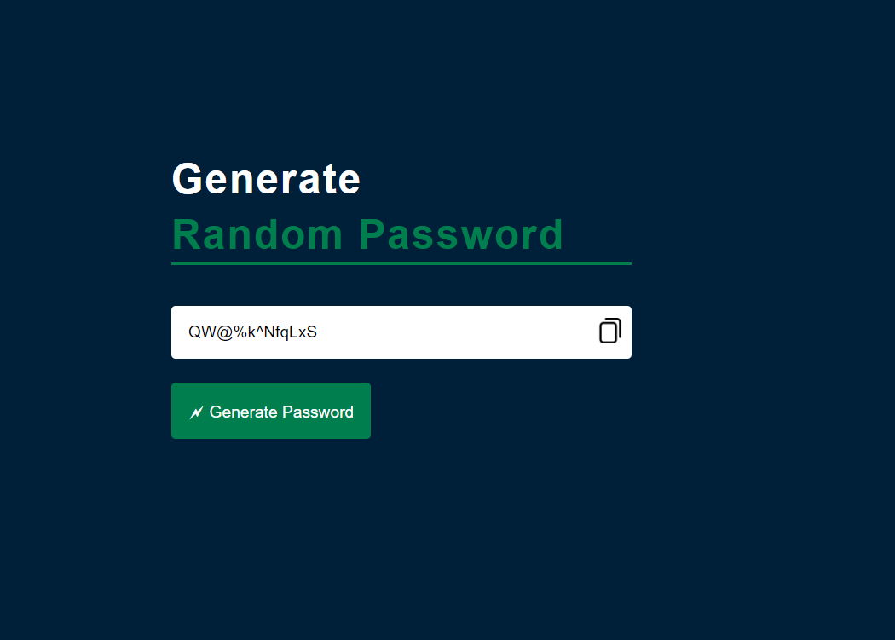

Random Password Generator

Screenshots
-----------

Site is live at https://reninmohan.github.io/Random-Password-Generator/

Overview
--------
This is a simple random password generator that generates a password of 12 characters containing alphabets (both uppercase and lowercase), numbers, and special characters. It provides a convenient way to create strong and secure passwords for various purposes.

Features
--------
- Generates a random password of 12 characters.
- Includes alphabets (uppercase and lowercase), numbers, and special characters.
- Easy to use interface.
- Allows copying the generated password to the clipboard.

Usage
-----
1. Open the Random Password Generator application.
2. Click on the "Generate Password" button.
3. A randomly generated password of 12 characters will appear in the input field.
4. Click on the "Copy Password" button to copy the generated password to the clipboard.

Technologies Used
-----------------
- HTML
- CSS
- JavaScript

